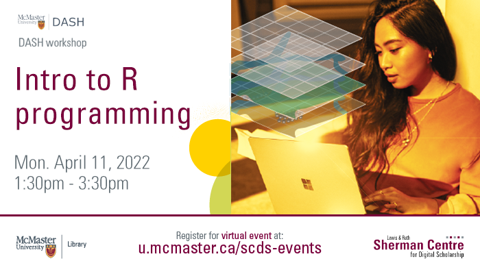

# Welcome to Intro to R Programming

R has a powerful suite of high-level statistical functions, but sometimes you need lower-level control over the functionality of your script. In this workshop, you will learn how to write programs in R using functions and control flow. We will cover functions, conditional blocks, loops, and debugging.

This website includes recordings of two sessions of "Intro to R" Programming. The 2022 session is led by Isaac Kinley, the 2021 session is led by Vivek Jadon.

Proceed to the [Preparation](preparation) page to get started.
